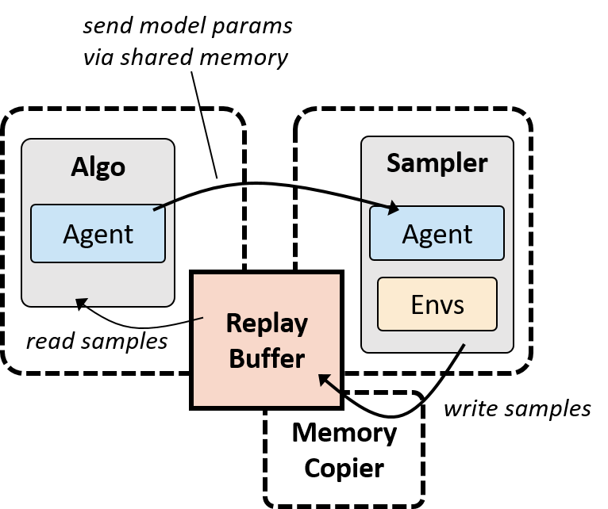

# EVA_Assignment-9-Phase2 (P2_S9) (Deep Reinforcement Learning)

## Twin Delayed Deep Deterministic Policy Gradient (TD3)

Twin Delayed Deep Deterministic Policy Gradient is a Deep Reinforcement Learning Algorithm, which is an improvement over the
Deep Deterministic Policy Gradient (DDPG) algorithm. DDPG has a drawback of constantly overestimating the Q values of the critic network
which build up errors. TD3 concurrently learns a Q function and a policy.
TD3 focusses on reducing the overestimation of bias.
Following are the main features of TD3 :- 
a) Using a pair of critic networks

Clipped Double-Q Learning. TD3 learns two Q-functions instead of one so its called TWIN, and uses the smaller of the two Q-values to form the targets in the Bellman error loss functions. It takes the smallest value of the two critic networks.

b) Delayed updates of the actor

Delayed Policy Updates. TD3 updates the policy (and target networks) less frequently than the Q-function. There is one policy update for every two Q-function updates.

c) Action noise regularisation
Target Policy Smoothing. TD3 adds noise to the target action, to make it harder for the policy to exploit Q-function errors by smoothing out Q along changes in action.

  
                                                    
                                                    
## Steps involved in the TD3 Algorithm

  ## 1 : Initialize
        All modules are imported and initialized.
  
  ## 2 : Replay Buffer
   Replay Buffer or Experience replay is where we store the agent's experiences et=(st,at,rt,st+1)
This means instead of running Q-learning on state/action pairs as they occur during simulation or actual experience, the system stores the data discovered for (state, action, reward, next_state) in a large table.

It has two methods, one is to Add Transition to Replay Buffer and the other method is Sample where list of transitions are randomly selected.

  
  
                                  
 ## 3 : Define Actor
 
Actor model is a neural network which has state as input and action as output.It is updated by backpropagation. Target Actor model is another neural network which is similar to Actor model but it is updated less frequently and mainly used for stability. Target Actor Model is updated using Polyak averaging from the Actor model
 
 
 ## 4 : Define Critic
 
 Critic class predicts Q value based on avtion.
 Two Critic Neural networks and Two Critic Target Neural networks.
 The critics forward() method returns the Q values for both critics to be used later. 
 
 
 ## 5  : Define TD3 Class
 Train the agent with two Q-value functions.
 During training, a TD3 agent:
   Updates the actor and critic properties at each time step during learning.
   Stores past experience using a circular experience buffer. The agent updates the actor and critic using a mini-batch of experiences   randomly sampled from the buffer.
Perturbs the action chosen by the policy using a stochastic noise model at each training step.

  ## Steps involved in this Class are as follows:-
  
  ## a) Initialize Actor,Actor Target, Critic and Critic Target
  ## b) Select Action
  ## c) Train
     
     Start by sampling a batch of transitions from the experience replay
     To train the two critic networks, use the following targets:

yt=r(st,at)+γ⋅mini=1,2Qi(st+1,μ(st+1)+[N(0,σ2)]MAX_NOISEMIN_NOISE)

First run the actor target network, using the next states as the inputs, and get μ(st+1). Then, add a clipped gaussian noise to these actions, and clip the resulting actions to the actions space. Next, run the critic target networks using the next states and μ(st+1)+[N(0,σ2)]MAX_NOISEMIN_NOISE, and use the minimum between the two critic networks predictions in order to calculate yt according to the equation above. To train the networks, use the current states and actions as the inputs, and yt as the targets.

To train the actor network, use the following equation:

∇θμJ≈Est~ρβ[∇aQ1(s,a)|s=st,a=μ(st)⋅∇θμμ(s)|s=st]

Use the actor’s  network to get the action mean values using the current states as the inputs. Then, use the first critic’s online network in order to get the gradients of the critic output with respect to the action mean values ∇aQ1(s,a)|s=st,a=μ(st). Using the chain rule, calculate the gradients of the actor’s output, with respect to the actor weights, given ∇aQ(s,a). Finally, apply those gradients to the actor network.
 
 

